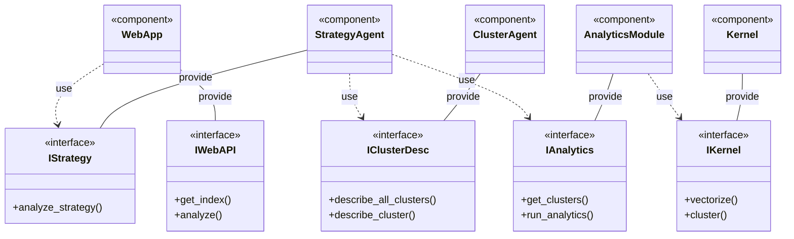

```mermaid
classDiagram
    class WebApp {
        <<component>>
    }
    class StrategyAgent {
        <<component>>
    }
    class ClusterAgent {
        <<component>>
    }
    class AnalyticsModule {
        <<component>>
    }
    class Kernel {
        <<component>>
    }

    class IWebAPI {
        <<interface>>
        +get_index()
        +analyze()
    }
    class IStrategy {
        <<interface>>
        +analyze_strategy()
    }
    class IClusterDesc {
        <<interface>>
        +describe_all_clusters()
        +describe_cluster()
    }
    class IAnalytics {
        <<interface>>
        +get_clusters()
        +run_analytics()
    }
    class IKernel {
        <<interface>>
        +vectorize()
        +cluster()
    }

    WebApp ..> IStrategy : use
    StrategyAgent -- IStrategy : provide
    
    StrategyAgent ..> IClusterDesc : use
    ClusterAgent -- IClusterDesc : provide
    
    StrategyAgent ..> IAnalytics : use
    AnalyticsModule -- IAnalytics : provide
    
    AnalyticsModule ..> IKernel : use
    Kernel -- IKernel : provide
    
    WebApp -- IWebAPI : provide
```
